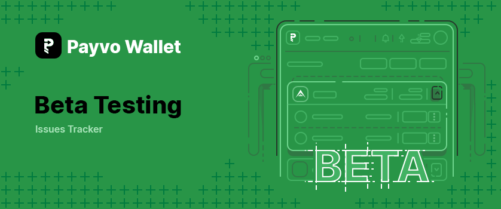

# Payvo Wallet - Beta Testing

The web wallet is available at [beta.payvo.com](https://beta.payvo.com/) and works in all major browsers on all major operating systems.

## Issue Templates

To facilitate the reporting of issues, bugs and general improvements, there are Issue Templates available in this repository. This means that when you want to open an issue, you will have the option to choose from a list of predefined templates. Make sure to choose the right template and fill it in accordingly. Issues that do not follow the proper issue template may be closed without further notice.

As always, make sure to go over the existing list of issues before you add your own to avoid duplication. When you find another issue that describes the same thing that you were about to report, make sure to either leave a comment on it or a reaction so we know there are more people that are affected by it.

### Bug

When you run into an issue with the web wallet, you can open a Bug Report to inform us about this. We consider an issue to be a bug, when you can answer yes to at least one of the below questions:

- **Does it inhibit me from using the regular flow of actions in the web wallet?** E.g. you get stuck on a step in a form, or you cannot continue the process of creating a transaction.
- **Does it result in a crash on a page?** E.g. you click a `continue` button while an input is not filled in and the next step crashes while trying to use the field's value.
- **Does it allow me to access something that I should not have access to?** E.g. you are able to access another profile's transaction overview.
- **Does it affect the UI in a negative way?** E.g. having content pushed out of view, links not resolving, or being unable to click on a button due to something else overlapping it or not being able to scroll to it.

### Improvement

If you find something that could be improved, but is not a bug as per definition above, you can open an improvement issue instead. These can include adjustments to an existing flow to make something more clear, to resolve an oversight or even to improve accessibility. Note that improvements are only aimed at improving existing functionality. When you find that something appears to be missing from the web wallet instead, you should consider the `Feature Request` template instead.

### Feature Request

For missing functionality or general ideas, you can make use of the Feature Request template to inform us of your idea. Make sure to be clear in your needs for a feature, as more details will make it easier for us to understand the requirements and make it into a proper task.